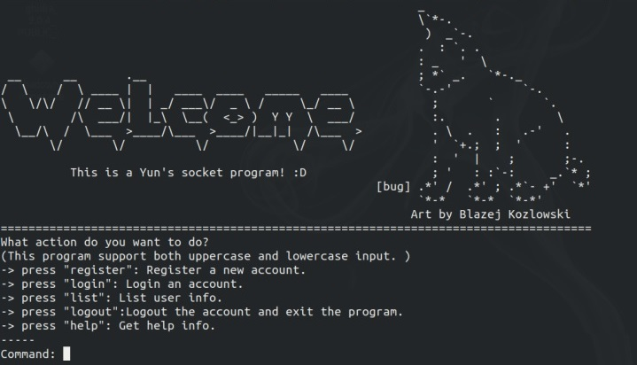

# socket_program_說明文件(C++)
### 【如何編譯】
* #### server
1. 開啟terminal移動到code資料夾
2. 使用「make」指令即可成功編譯

* #### client
1. 開啟terminal移動到client資料夾
2. 使用「make」指令即可成功編譯

### 【程式需求執行環境】
僅可在linux系統運行，且以ubuntu18.04為佳。(意指經測試，可在ubuntu18.04順利編譯成功)

### 【執行server程式(編譯後的執行檔)】
輸入指令: ./client <IP address of the server> <port of the server>
其中，
•	<port of the server>需替換為server程式在server端綁定的port號。

### 【程式使用說明】
#### 如何使用:
當使用者一執行 client 程式， 即可看到使用說明。 使用者只要輸入如同說明文件所示的文字， 即可進入與程式一問一答的操作環境內，目前本程式支援五項功能。
Client 程式入口頁面如下:

#### 協定
　　本次程式實作中，在part1的基礎上，我實作了簡易的通訊協定。該協定運作如下: 
　　(本協定概念借鑑　博碩出版的「北極星」團隊著作「特洛伊木馬病毒程式設計使用Python加強版」)
* ##### sender
　　無論是client或者server，在傳送資料前都必須事先傳送預計傳送的字串長度，我稱其為header。在程式傳送資料前，我會先計算該次傳送的資訊量，將該值以header的形式加在訊息的前端。除此之外，為了使程式的header能更有彈性，讓紀錄傳送長度的size field大小能視資訊量多寡伸縮，降低over header的壓力，**header並非單純由單一個紀錄size的field構成，而是由1bytes的tags與不定長度的size field組合而成。** 
　　header中用以標示size field大小的tags 共有三種，分述如下
* 'B': 表示接下來的size field大小為1 bytes
* 'H': 表示接下來的size field大小為2 bytes
* 'L': 表示接下來的size field大小為4 bytes

* ##### receiver
　　receiver在接收訊息後，首先先收取1 bytes的資料，據此判斷size field的長度，再收取該size field長度的資料，最後再解析size field的訊息後，收取該長度的資料即能確保資料已完整收取。

### 備註
　　因為本次作業我實作了application layer protocol，因此能成功連接server的client，必須使用我自定義的yun_send和yun_recv，並且引入定義該二函式的yun_function.h於source code中。在此次作業我以實做了該類型的client，並將它放置於資料夾client下，該支程式僅能支援特定語法，執行程式即可看見使用說明的UI。

### 【參考資料】
* 博碩出版的「北極星」團隊著作「特洛伊木馬病毒程式設計使用Python加強版」
* [thread_pool程式碼](https://ncona.com/2019/05/using-thread-pools-in-cpp/)
